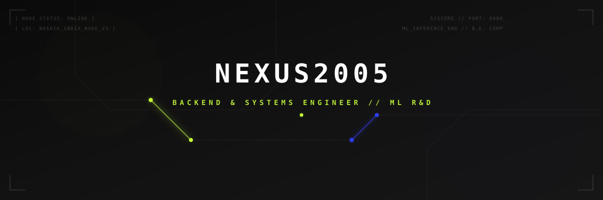

<!-- Header Grid Banner -->
<p align="center">
  
</p>

<!-- Dynamic Typing Telemetry Header -->
<p align="center">
  
</p>

---

## ⚡ BIO-TELEMETRY // SYSTEM SUMMARY

I am a **Systems-focused Backend Engineer and Machine Learning Researcher** pursuing my B.E. in Computer Engineering at **MET Institute of Engineering** (CGPA: `8.72 / 10.0`). I specialize in co-architecting low-latency microservices, optimizing database transaction paths, and compiling lightweight deep-neural network pipelines for egocentric edge devices.

- 🛠️ **Core Specialization**: High-performance backend infrastructure, Zero Trust microservice architectures, and edge inference optimization.
- 🎯 **Recent Focus**: Transformer sequence limits, self-attention bottlenecks, and geospatial deep learning pipelines.
- 👥 **Current Deployment**: Founding Backend Engineer at **PROTON** optimizing B2B manufacturing demand-routing systems.

---

## 🌐 CONNECT WITH ME // SECURE LINKS

<p align="left">
  <a href="https://www.linkedin.com/in/omkar-ahirrao2005/" target="_blank">
    
  </a>
  <a href="https://x.com/StudioTvworld" target="_blank">
    
  </a>
  <a href="https://github.com/Nexus2005" target="_blank">
    
  </a>
  <a href="https://www.instagram.com/omkar._8eight?igsh=MTUybDMwY21oaGF3eA==" target="_blank">
    
  </a>
  <a href="mailto:omkarahirrao2005@gmail.com" target="_blank">
    
  </a>
</p>

---

## 💼 EXPERIENCE // TIMELINE NODES

<details open>
<summary>⚡ <b>Founding Backend Engineer // PROTON (Nexatech Innovations)</b> [2024 - PRESENT]</summary>
<br>

* **Objective**: Architect modular backend microservices for B2B manufacturing demand-forecasting & automated payouts.
* **Key Achievements**:
  * Optimized PostgreSQL schema queries, reducing high-traffic marketplace endpoint latency by **40%**.
  * Developed demand-routing algorithms utilizing K-Means clustering.
  * Configured Flask services deployed under secure AWS VPC perimeters.
* **Stack**: `Python`, `Flask`, `PostgreSQL`, `AWS (Lambda/EC2)`, `Docker`, `Microservices`

</details>

<details>
<summary>🔬 <b>R&D Engineering Intern // TechMET IT Solutions</b> [JAN 2026 - FEB 2026]</summary>
<br>

* **Objective**: Conduct deep R&D on Large Language Model inference constraints and sequence processing training frameworks.
* **Key Achievements**:
  * Analyzed self-attention and Transformer bottleneck profiles (BERT, GPT variants).
  * Co-designed industrial automation prototypes, decreasing computation cycles by **30%**.
* **Stack**: `Transformers`, `GPT-R&D`, `BERT`, `LLM Workflows`, `Industrial Automation`

</details>

<details>
<summary>🛡️ <b>Software Engineering Trainee // EduSkills Co-ops</b> [2024  -  2025]</summary>
<br>

* **Objective**: Compile and sandbox secure REST APIs and Zero Trust network boundaries.
* **Key Achievements**:
  * Built secure Flask/Django REST APIs equipped with JWT authorization structures and OWASP vulnerability mitigations.
  * Implemented containerized sandbox deploys on GCP/AWS nodes.
* **Stack**: `Django`, `Flask`, `JWT Auth`, `Zero Trust NGFW`, `Docker`, `GCP/AWS`

</details>

---

## 💻 PROJECTS // GRAPHICAL TELEMETRY

### 🪐 PROTON Distributed Core Architecture
> Modular backend nodes handles payments, marketplace tracking, and database triggers.
```text
[CLIENT_REQ] ──> [NGINX PROXY] ──> [FLASK API GATEWAY] ──> [POSTGRESQL CLUSTER]
                                             │
                                             └──> [AWS LAMBDA (FORECAST)]
```
* **Performance Metric**: Database latency optimized by **40%**.
* **Key Stack**: `Flask` | `PostgreSQL` | `Docker` | `AWS Lambda`

### 🛰️ ISRO Wildfire Geospatial Risk Emulator
> Geospatial model mapping and simulating wildfire spread patterns using 30m resolution multispectral satellite tiles.
```text
[SATELLITE RASTER] ──> [GDAL PARSER] ──> [U-NET MODEL] ──> [2-4 HR EARLY WARNING]
```
* **Performance Metric**: **2-4 Hours Early Warning** predictive curves.
* **Key Stack**: `PyTorch` | `GDAL` | `Rasterio` | `LSTM`

### 🌾 Agri NPK Soil Curve Recommendation Engine
> Precision curve recommendation algorithm evaluating soil-nutrient properties to prevent over-fertilization.
* **Performance Metric**: **~18% cut** in soil over-fertilization margins.
* **Key Stack**: `Scikit-learn` | `Pandas` | `Random Forest` | `REST API`

---

## 🔬 SCIENTIFIC WRITING & AI R&D.

| Research Classification | Objective & Description | Telemetry |
| :--- | :--- | :--- |
| **🤖 GENERATIVE AI ARCHITECTURES** | **Hyperscale Scaling Limits**: Architectural review exploring computational bottlenecks, self-attention limits, and sequence scaling optimizations. | [Drive Link](https://drive.google.com/file/d/1p76J481yI_TvnLMUGQ0V_buMM3MeqTIt/view?usp=sharing) |
| **🕶️ EGOCENTRIC AR SYSTEMS** | **Wearable Egocentric AR Glasses**: Systematic review analyzing low-latency edge AI inference optimizations and taxonomy of egocentric spatial coprocessors. | [Drive Link](https://drive.google.com/file/d/1k1eSxNJx-WxwnvqpehVReFwfPgBGIzfJ/view?usp=sharing) |

---

## 🌟 NON-TECHNICAL & LEADERSHIP SKILLS

I translate technical telemetry into structured sprints, lead cross-functional hackathon nodes, and map out scalable processes.

```text
Systems Architecting         [████████████████░░░░] 80% // Pipeline Structuring
Technical R&D                [██████████████████░░] 90% // Deep Inquiry & Analysis
Project Sprint Coordination [████████████████░░░░] 80% // Core Agile Scrums
Debate & Technical Writing   [██████████████████░░] 90% // Structural Publications
```

---

## 📈 CONTRIBUTION ACTIVITY // TELEMETRY GRAPH

### 📊 Weekly Node Activity Wave
<p align="center">
  
</p>

### 📈 Dynamic Analytics Deck
<table align="center" border="0" cellpadding="10">
  <tr>
    <td width="50%">
      
    </td>
    <td width="50%">
      
    </td>
  </tr>
</table>

<p align="center">
  
</p>

### 🎮 Contribution Snake Emulator
<p align="center">
  <!-- The contribution snake animated SVG is generated daily by the GitHub Action workflow -->
  
</p>

---

<p align="center">
  <samp>
    [SYSTEM_NODE_V3] // SECURE CONNECTION STABLE // LET'S SHAPE THE FUTURE
  </samp>
</p>
